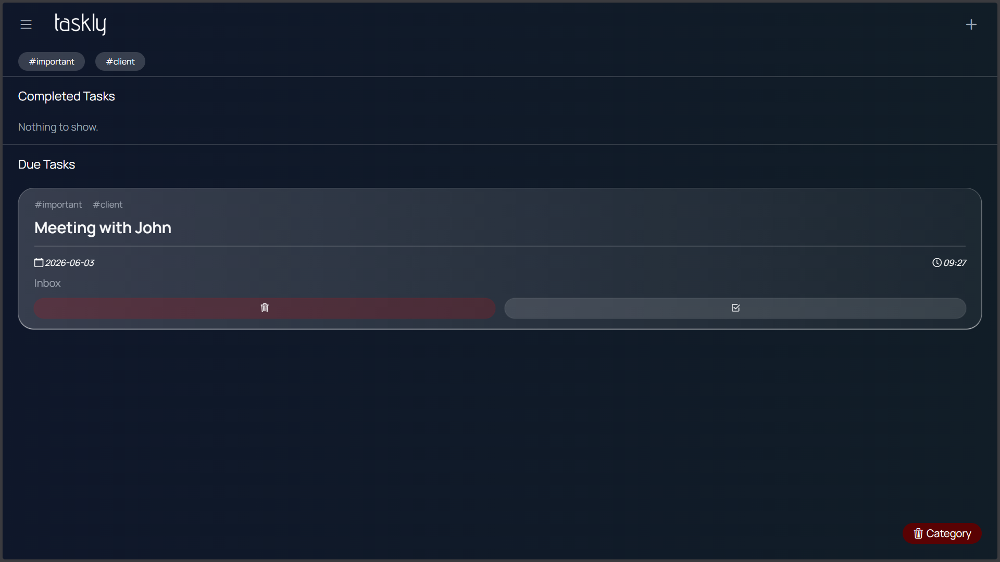

# Taskly

A clean, minimal task manager that runs entirely in the browser — no backend, no accounts, no setup. Tasks and categories are persisted in `localStorage`, so your data stays across sessions.


---

## Screenshot



---

## Features

- **Categories** — Organize tasks into custom categories; delete a category and all its tasks together
- **Hashtag filtering** — Tag tasks with `#hashtags` and filter the board by any tag in one click
- **Deadlines** — Attach a date and time to every task
- **Complete / Delete** — Mark tasks done (they move to the Completed section) or remove them entirely
- **Animated UI** — Smooth transitions powered by Animate.css
- **Fully offline** — Zero server calls; all data lives in `localStorage`
- **Responsive** — Works on desktop and mobile

---

## Getting Started

No build step required. Just open the file.

```bash
git clone https://github.com/your-username/taskly.git
cd taskly
open index.html   # or double-click it in your file explorer
```

Or serve it locally with any static server:

```bash
npx serve .
# → http://localhost:3000
```

---

## Project Structure

```
taskly/
├── index.html   # App shell and markup
├── index.js     # All app logic (vanilla JS)
├── style.css    # Styles (CSS custom properties + media queries)
├── logo.svg     # Wordmark shown in the navbar
└── icon.svg     # Favicon / browser tab icon
```

---

## Usage

| Action | How |
|---|---|
| Add a task | Click **+** in the top-right → fill in title, deadline, and at least one `#tag` |
| Switch category | Open the **☰ sidebar** → click any category |
| Add a category | Open the sidebar → **Add Category** → type a name → press Enter |
| Delete a category | Switch to the category, then click **🗑 Category** (bottom-right) |
| Filter by tag | Click any `#tag` chip in the filter strip at the top |
| Complete a task | Click the ✓ button on a task card |
| Delete a task | Click the 🗑 button on a task card |

---

## Dependencies

All dependencies are loaded from CDN — no `npm install` needed.

| Library | Purpose |
|---|---|
| [Bootstrap Icons 1.13](https://icons.getbootstrap.com/) | UI icons |
| [Animate.css 4.1](https://animate.style/) | Entry/exit animations |
| [Manrope](https://fonts.google.com/specimen/Manrope) (Google Fonts) | Typography |

---

## Browser Support

Any modern browser (Chrome, Firefox, Safari, Edge). Requires `localStorage` support (enabled by default in all major browsers).

---

## License

[MIT](LICENSE)
